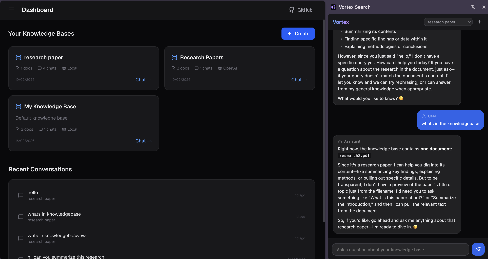
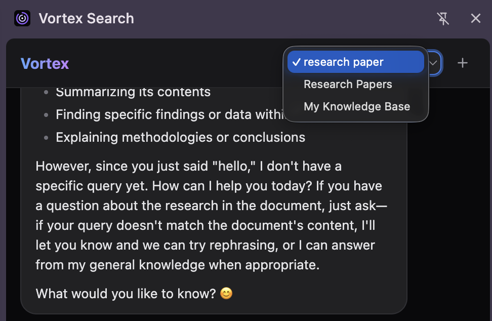

<p align="center">
  <h1 align="center">Vortex Search</h1>
  <p align="center">Chrome extension for <a href="https://github.com/ankushchhabra02/vortex">Vortex</a> — ask your knowledge base from any tab</p>
</p>

<p align="center">
  
  
  
  
</p>

<p align="center">
  <a href="#install">Install</a> &middot;
  <a href="#features">Features</a> &middot;
  <a href="#architecture">Architecture</a> &middot;
  <a href="#self-hosting">Self-Hosting</a> &middot;
  <a href="#security">Security</a>
</p>

---

Vortex Search puts your Vortex knowledge base one keystroke away. Press `Alt+Shift+V` anywhere in
Chrome and a side panel opens alongside the page you're reading — ask a question, get a streamed
answer with source citations, keep the thread going. The conversation is saved in Vortex itself,
so it appears in your chat history there.

**No API key, no configuration screen.** It reuses the Vortex session you're already logged into.

## Features

### Chat
- **Side panel, not a popup** — Popups close the moment they lose focus; click the page and your answer dies mid-stream. The panel stays open while you browse, scroll, and switch tabs.
- **Streaming answers** — Tokens render as they arrive, with a shimmer placeholder until the first one lands, matching the web app's behaviour.
- **Real conversations** — Follow-up questions keep context. The thread is persisted server-side via `conversationId`, so it shows up in Vortex's own history rather than living only in the panel.
- **Source citations** — `[n]` chips under each answer, with the similarity score on hover, read from the `X-Sources` response header.
- **Knowledge base switcher** — Pick the knowledge base from the header; the choice persists. Switching starts a fresh conversation, since it's a different corpus.

### Rendering
- **Full markdown** — Headings, lists, tables, blockquotes, and inline formatting via `marked` with GFM enabled.
- **Syntax highlighting** — Fenced code blocks highlighted with highlight.js.
- **Matches the web app** — Vortex's chat renders with react-markdown + remark-gfm + rehype-highlight; the panel vendors the vanilla equivalents to produce the same output, styled with the same blue-600 bubbles and zinc surfaces.

### Auth
- **Zero configuration** — The instance URL ships in the manifest, so host permission is granted at install. Your existing Supabase session cookie does the rest.
- **Login gate** — Logged out? The panel says so and offers a button, then re-checks by itself when you return to it. Logging in from any tab is enough.
- **Readable failures** — Every error state maps to something actionable rather than a stack trace: `NOT_LOGGED_IN`, `RATE_LIMIT`, `UNREACHABLE`, `FORBIDDEN`.
## Preview

### Side Panel



### Knowledge Base Switcher



## Install

The extension is unpacked — there's no build step and nothing to compile.

```bash
git clone https://github.com/ankushchhabra02/vortex-extension.git
```

1. Open `chrome://extensions`
2. Enable **Developer mode** (top right)
3. Click **Load unpacked** and select the cloned folder
4. Log into your Vortex instance in the same browser

Press `Alt+Shift+V`, or click the toolbar icon, to open the panel.

## Usage

| Action | How |
|--------|-----|
| Open the panel | `Alt+Shift+V` or the toolbar icon |
| Send a question | `Enter` |
| New line | `Shift+Enter` |
| New conversation | `+` in the header |
| Switch knowledge base | Dropdown in the header |

Rebind the shortcut at `chrome://extensions/shortcuts`.

## Architecture

```
Chrome
  │
  ├── Toolbar button / Alt+Shift+V
  │        │
  │        ▼
  │   background.js          ← four lines: route the action to the side panel
  │        │
  │        ▼
  └── Side panel (panel.html)
           ├── panel.js      ← chat history, streaming, login gate, composer
           ├── md.js         ← markdown → HTML → allowlist sanitiser
           └── api.js        ← Vortex client, error taxonomy
                    │
                    │  fetch with credentials: 'include'
                    ▼
        Your Vortex instance
           ├── GET  /api/knowledge-bases   ← the knowledge base dropdown
           └── POST /api/chat              ← streamed answer
                                              X-Sources → citation chips
                                              X-Conversation-Id → thread continuity
```

There is no service worker doing real work, no content scripts, and no access to the pages you
visit. The panel talks to exactly one origin.

### Auth flow

Vortex authenticates with Supabase SSR cookies. Because the instance origin is declared in
`host_permissions`, Chrome attaches those cookies to the panel's requests — so being logged into
Vortex in the browser *is* the setup.

Vortex's middleware redirects unauthenticated API calls to `/login` with a `307` rather than
returning `401`, so the client treats a final response URL containing `/login` as a signed-out
state and shows the login gate.

## Tech Stack

| Layer | Technology |
|-------|-----------|
| Platform | Chrome Manifest V3, side panel API |
| UI | Vanilla HTML/CSS/JS — no framework, no bundler |
| Markdown | marked (GFM) |
| Highlighting | highlight.js |
| Sanitisation | Hand-rolled DOM allowlist (`md.js`) |
| Storage | `chrome.storage.local` (selected knowledge base only) |

## Project Structure

```
manifest.json         # MV3: 2 permissions (storage, sidePanel), 1 host
background.js         # makes the toolbar button open the side panel
panel.html            # side panel markup
panel.js              # chat history, streaming, sources, login gate
api.js                # Vortex API client + error taxonomy
md.js                 # markdown rendering + HTML allowlist
style.css             # design tokens shared with the web app
chat.css              # chat layout and prose styles
vendor/
├── marked.js         # MIT
├── highlight.js      # BSD-3-Clause
└── highlight.css     # github-dark theme
icons/
```

## Self-Hosting

Pointing the extension at your own Vortex deployment takes two edits:

```js
// api.js
BASE: 'https://your-vortex-instance.com',
```

```json
// manifest.json
"host_permissions": ["https://your-vortex-instance.com/*"]
```

Reload the extension at `chrome://extensions` afterwards.

## Security

- **Model output is never trusted as HTML.** Answers are markdown from an LLM that has read documents anyone may have uploaded. `marked` passes raw HTML straight through — `<script>`, `` and `javascript:` links all survive parsing — so `md.js` runs the output through an allowlist before it reaches the DOM: dangerous elements are dropped, unknown tags unwrapped, and every attribute except a safe `href` and `class` stripped.
- **Links open in a new tab.** Without `target="_blank"` a link would navigate the panel away from your conversation.
- **Minimal permissions.** `storage` and `sidePanel`, plus a single host. No `tabs`, no `scripting`, no content scripts, no access to page content.
- **Nothing is collected.** The only thing stored is which knowledge base you last picked. No analytics, no third-party requests, no network calls to anything but your Vortex instance.

## Troubleshooting

**Panel says "Log into Vortex"** — Open your Vortex instance and sign in. The panel re-checks automatically when you switch back to it.

**Panel says "Can't reach Vortex"** — The instance is down or the URL in `api.js` doesn't match `host_permissions` in `manifest.json`. Both must point at the same origin.

**Answers arrive but citations don't** — Citations come from the `X-Sources` header, which Vortex only sets when the retrieval step returns matches. An empty knowledge base produces answers with no chips.

**Shortcut does nothing** — Chrome silently drops conflicting shortcuts. Check `chrome://extensions/shortcuts` and rebind.

**Changes to the code aren't picked up** — Edits to `manifest.json` need a full reload from `chrome://extensions`, not just closing the panel.

## Contributing

Issues and pull requests welcome. The extension has no build step, so the development loop is:
edit a file, hit reload at `chrome://extensions`, reopen the panel.

## License

MIT
